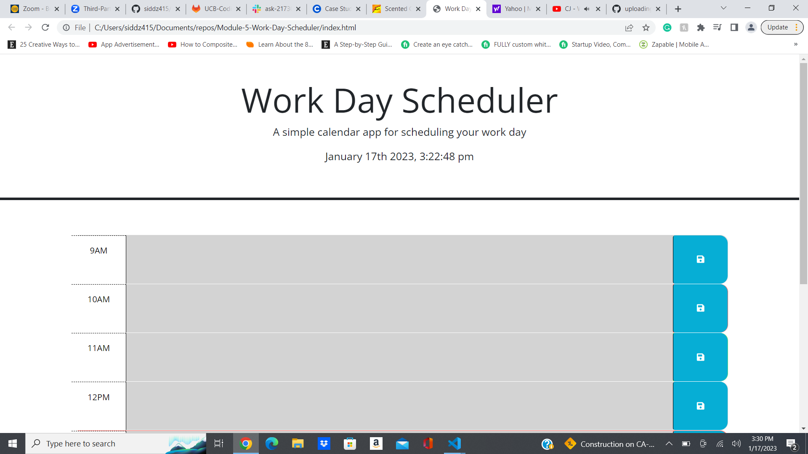

# Module-5-Work-Day-Scheduler
# Description
This is a work day planner app that loops through the hours of 9am - 5pm, which is the current day that the user opens the app. The app uses moment.js to handle time. The app also allows the user to enter and save text into any description block that has a class of future. The data will be saved to the localStorage of the browser. The past hours are highlighted gray, the current hour red, and future hours green.

## Github Repo Link
https://github.com/siddz415/Module-5-Work-Day-Scheduler

## Github Pages Link
https://siddz415.github.io/Module-5-Work-Day-Scheduler/

## Screenshot
 